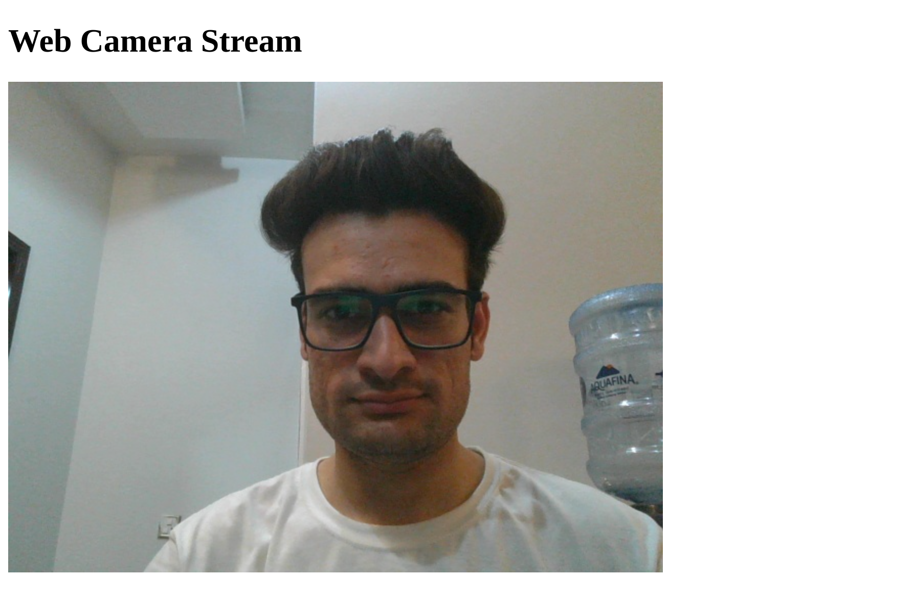

# WebCameraStreamFlaskApp

WebCameraStreamFlaskApp is a Flask-based application that allows you to capture frames from a web camera and stream them in real-time to a web page. It provides a simple and intuitive way to display live video feeds using the Flask web framework and OpenCV library.

## Features
- Capture frames from the default web camera (index 0) in real-time.
- Stream the captured frames to a web page using Flask and OpenCV.
- Render the live video feed on an HTML page, accessible through a web browser.
- Supports streaming in JPEG format for efficient transmission.

## Installation
1. Clone or download this repository.
2. Install the required dependencies by running `pip install -r requirements.txt`.
3. Run the Flask application with `python app.py`.
4. Open your web browser and access the application at `http://localhost:5000`.

## Usage
1. Launch the application and make sure your web camera is connected.
2. Open a web browser and access the provided URL.
3. You should see the live video feed from your web camera displayed on the web page.
4. Experiment with integrating the application into your own projects or customize the HTML template to suit your needs.

## Contributing
Contributions are welcome! If you have any ideas, improvements, or bug fixes, please open an issue or submit a pull request.

## License
This project is licensed under the [Apache License](LICENSE).

## Acknowledgements
This application was built with the help of Flask and OpenCV libraries, which provide powerful tools for web development and computer vision tasks, respectively.

Feel free to modify the content according to your preferences and project specifics.
